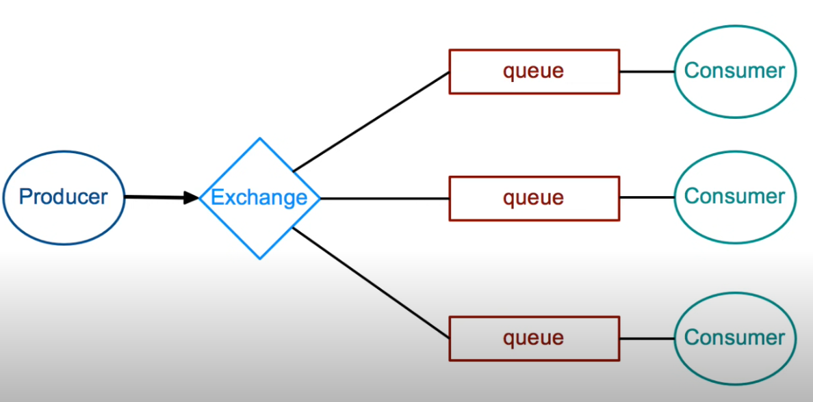
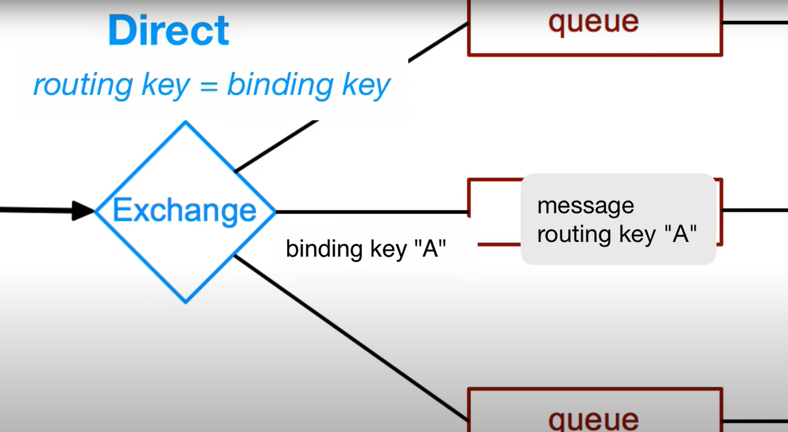
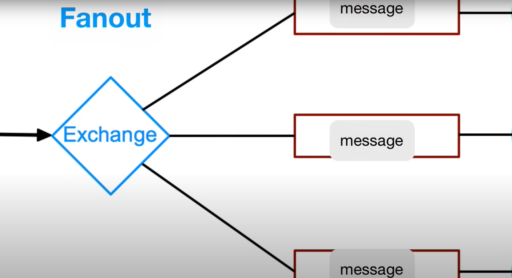
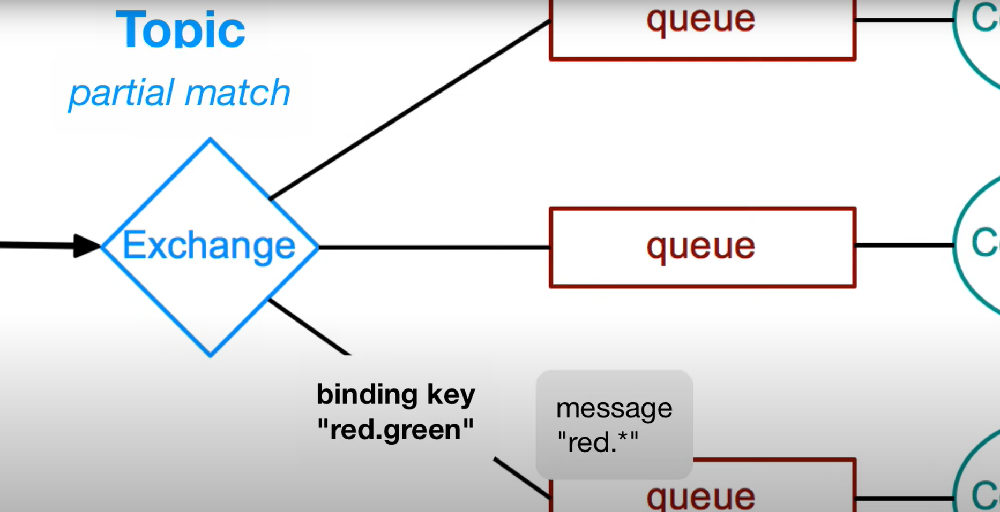
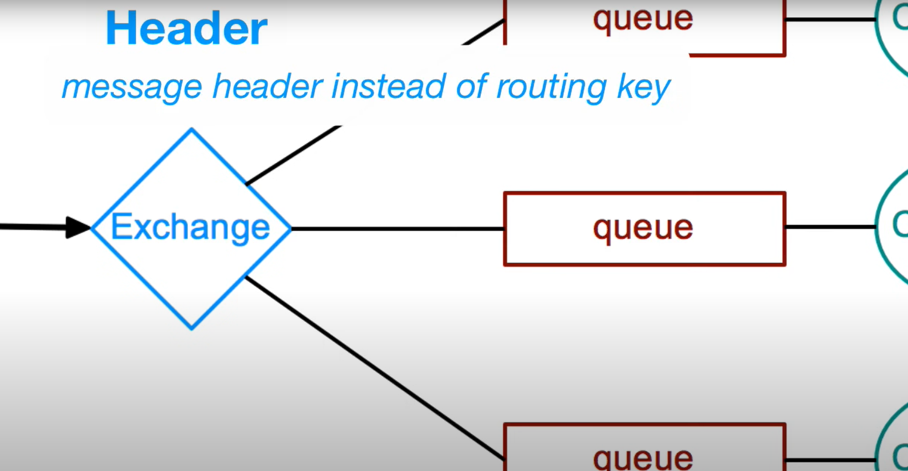
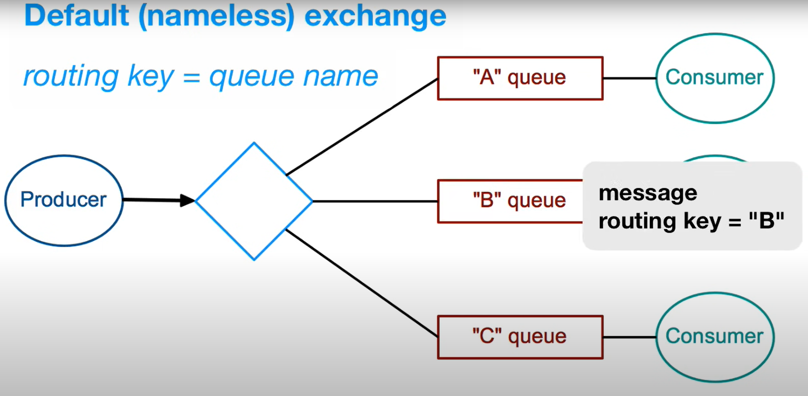

list queue: `$ rabbitmqctl list_queues` \

**Note**

Exchange connect to the Queue by Binding and binding key.

Direct Exchange: \
`await channel.assertExchange('direct_exchange', 'direct', { durable: true });` \
Direct Exchange định tuyến tin nhắn dựa trên một routing key cụ thể.
Khi một tin nhắn được gửi tới Direct Exchange, nó sẽ được chuyển tới Queue có binding với Exchange đó và có routing key khớp với routing key của tin nhắn.

Fanout Exchange: \
`await channel.assertExchange('fanout_exchange', 'fanout', { durable: true });` \
Fanout Exchange gửi tin nhắn tới tất cả các Queue mà nó được binding với, mà không quan tâm đến routing key.
Điều này thích hợp cho các trường hợp khi một tin nhắn cần được gửi tới nhiều Queue mà không cần quan tâm đến nội dung của tin nhắn.

Topic Exchange: \
`await channel.assertExchange('topic_exchange', 'topic', { durable: true });` \
Topic Exchange định tuyến tin nhắn dựa trên một mẫu hoặc pattern của routing key.
Khi một tin nhắn được gửi tới Topic Exchange, nó sẽ được chuyển tới các Queue có binding với Exchange đó và có routing key phù hợp với pattern được xác định trước.

Headers Exchange: \
`await channel.assertExchange('headers_exchange', 'headers', { durable: true });` \
Headers Exchange định tuyến tin nhắn dựa trên các thuộc tính header của tin nhắn.
Headers Exchange cho phép định tuyến tin nhắn dựa trên các thuộc tính header cụ thể mà người dùng xác định.

Default Exchange: \
Default Exchange là một Exchange có sẵn trong RabbitMQ mà tất cả các Queue đều được binding với nó mặc định.
Khi một tin nhắn được gửi tới Default Exchange và không có Exchange nào khác khớp với routing key, nó sẽ được gửi tới Queue được đặt tên giống với routing key.

**Core concepts**
>`Producer` emits messages to `exchange` \
>`Consumer` receives messages from `queue` \
>`Binding` connects an exchange with a queue using `binding key` \
>Exchange compares `routing key` with binding key \
>Messages distribution depends on `exchange type` \
>Exchange types: fanout, direct, topic and headers

